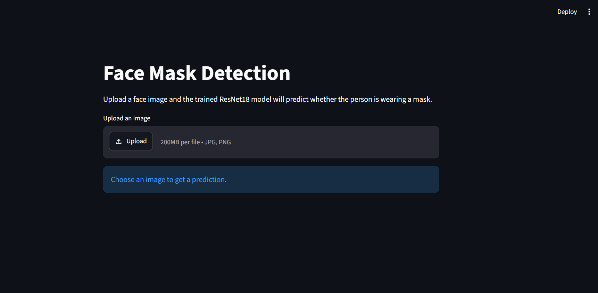
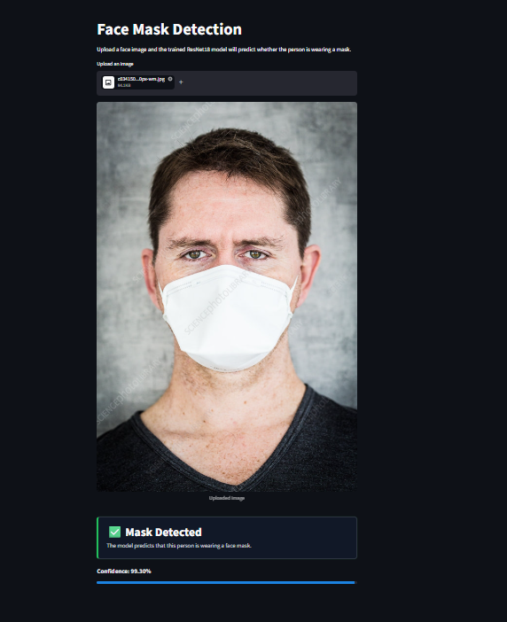
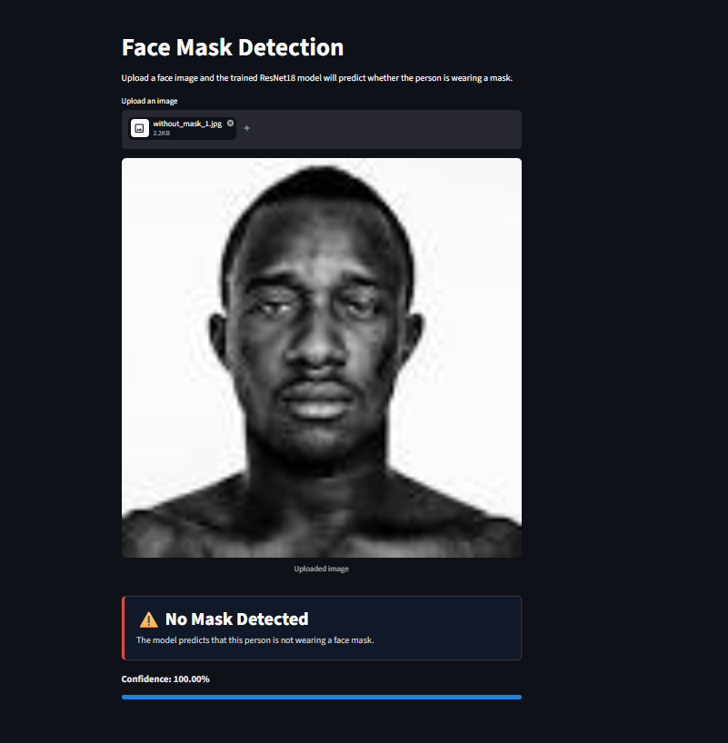
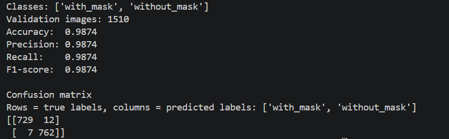

# Face Mask Detection with PyTorch

This project trains and runs a PyTorch image classifier that detects whether a face is wearing a mask.

It uses your existing dataset:

```text
data/
  with_mask/
  without_mask/
```

## Dataset

The dataset used in this project is from Kaggle:

[Face Mask Detection Dataset by Omkar Gurav](https://www.kaggle.com/datasets/omkargurav/face-mask-dataset)

It contains `7,553` RGB images split into two folders:

- `with_mask`: 3,725 images
- `without_mask`: 3,828 images

The model uses transfer learning with ResNet18 and saves the best trained model to:

```text
models/mask_detector.pth
```

## Requirements

- Python 3.12.2
- PyTorch
- torchvision
- Pillow
- tqdm
- scikit-learn
- matplotlib
- Streamlit

Create and activate a virtual environment:

```powershell
python -m venv .venv
.\.venv\Scripts\Activate.ps1
```

Install the required packages:

```bash
pip install -r requirements.txt
```

## Train the Model

From the project root, run:

```bash
python src/train.py
```

The training script:

- loads images with `ImageFolder`
- converts every image to RGB
- resizes every image to `224x224`
- splits the dataset into training and validation data
- trains a 2-class ResNet18 classifier
- saves the best model to `models/mask_detector.pth`

Your current trained model reached about `98.74%` validation accuracy.

## Predict One Image

After training, run:

```bash
python src/predict.py path/to/image.jpg
```

Example:

```bash
python src/predict.py data/with_mask/with_mask_1.jpg
```

The script prints the predicted class and confidence score.

## Evaluate the Model

Run:

```bash
python src/evaluate.py
```

The evaluation script:

- loads `models/mask_detector.pth`
- recreates the same validation split used during training
- calculates accuracy, precision, recall, and F1-score
- prints a confusion matrix

Example result from the current model:

```text
Accuracy:  0.9874
Precision: 0.9874
Recall:    0.9874
F1-score:  0.9874

Confusion matrix:
[[729  12]
 [  7 762]]
```

## Streamlit Web App

Run:

```bash
streamlit run app/app.py
```

The app lets you upload an image, displays the image, and predicts:

- `Mask Detected`
- `No Mask Detected`

It also shows a confidence score and progress bar.

## Screenshots

### App Home



### Mask Detected



### No Mask Detected



### Evaluation Metrics



## Project Structure

```text
face-mask-detection-pytorch/
  app/
    app.py
  data/
    with_mask/
    without_mask/
  models/
    mask_detector.pth
  src/
    evaluate.py
    train.py
    predict.py
  screenshots/
    evaluation_metrics.png
    homepage.png
    mask_detected.png
    no_mask_detected.png
  requirements.txt
  README.md
  .gitignore
```

## Notes

The first training run may download pretrained ResNet18 weights through `torchvision`.
If you do not have internet access, install `torchvision` first and make sure the pretrained weights are available in your local PyTorch cache.

The saved model file is ignored by Git in `.gitignore`, so keep a local copy of `models/mask_detector.pth` if you need to move the project to another machine.
